# perception\_ecu\_container

## Introduction

This repository provides a sample environment working with Jetson + GMSL cam + ROS2.

The following figure shows a system overview.



## Getting Started

### Prerequisites
- Camera: v4l2 compatible cameras, including TIER IV Automotive HDR Camera C1/C2
- ECU: Jetson AGX Xavier from NVIDIA Coorp.
- Board support packages: NVIDIA L4T R32.6.1 (including Ubuntu 18.04) or higher

An example connection between ECUs:


#### [for RQX-58G from ADLINK Technology, Inc. users] BSP installation
This repository assumes RQX-58Gs are correctly set up by following to the official quick start guide from ADLINK Technology, Inc. Please see [the official document](https://www.adlinktech.com/Products/Download.ashx?type=MDownload&isQuickStart=yes&file=1783%5croscube-x-bsp-qsg-l4t-32.5.0-kernel-1.0.8.pdf) in detail.


### Installing dependencies
```bash
git clone https://github.com/tier4/perception_ecu_container.git
cd perception_ecu_container
./setup-dev-env.sh
```

### Buiding docker
```
./docker/build.sh
```

### Running docker
```
./docker/run.sh
```

This script mounts `perception_ecu_container` directory onto `/workspace` in docker container.

For example, the followings shows how to execute single camera object detection
```bash
./docker/run.sh
source /workspace/install/setup.bash  # Don't miss enabling workspace ROS packages
ros2 launch perception_ecu_or_launch perception_ecu_or.launch.xml
```

### TIER IV Automotive HDR Camera device driver
- The contents of this repository are tested using [TIER IV Automotive HDR Camera C1](https://sensor.tier4.jp/automotive-hdr-camera). Device driver are provided at https://github.com/tier4/tier4_automotive_hdr_camera 
- Please follow the installation guide [[English](https://github.com/tier4/tier4_automotive_hdr_camera/releases/download/v1.1.0/TIER.IV.Automotive.HDR.Camera.C1.Quick.Start.Guide.Nvidia.Jetson.AGX.Orin.DevKit._EN_v0_1_1.pdf)] [[Japanese](https://github.com/tier4/tier4_automotive_hdr_camera/releases/download/v1.1.0/TIER.IV.Automotive.HDR.Camera.C1.Quick.Start.Guide.Nvidia.Jetson.AGX.Orin.DevKit._JPN_v0_1_1.pdf)] to install the device driver manually.
    - **Note: The latest device driver will be installed automatically during executing setup script in the following section. **
    - [For RQX-58G users] The camera type (i.e., C1/C2) that can connect is fixed for each GMSL2 port. The following table shows the default setting:

      | GMSL2 port No.          | 1  | 2  | 3  | 4  | 5  | 6  | 7  | 8  |
      |-------------------------|----|----|----|----|----|----|----|----|
      | connectable camera type | C1 | C1 | C2 | C2 | C1 | C1 | C2 | C2 |

## Repository overview
- [tier4/perception_ecu_container](https://github.com/tier4/perception_ecu_container)
    - Meta-repository containing `.repos` file to construct perception-ecu workspace
- [tier4/perception_ecu_launch](https://github.com/tier4/perception_ecu_launch.git)
- [tier4/sensor_trigger](https://github.com/tier4/sensor_trigger.git)
- [tier4/ros2_v4l2_camera](https://github.com/tier4/ros2_v4l2_camera.git)
- [tier4/perception_ecu_individual_params](https://github.com/tier4/perception_ecu_individual_params)
- [autowarefoundation/autoware.universe](https://github.com/autowarefoundation/autoware.universe.git)
