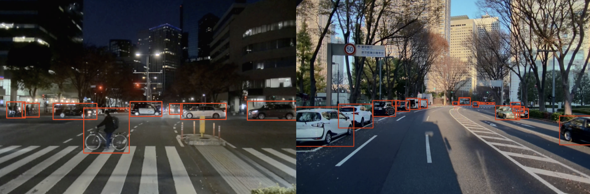

# Perception ECU Container

This repository provides a sample environment working with Jetson + GMSL2 cam + ROS2.
The following images show object recognition results using the contents of this repository.



This repository is a docker-based ROS development environment. An overview of the system is shown below.



## Getting Started

### Prerequisites
- Camera: v4l2 compatible cameras, including [TIER IV Automotive HDR Camera C1](https://sensor.tier4.jp/automotive-hdr-camera)
- ECU: Jetson AGX Xavier from NVIDIA Coorp.
- Board support packages: NVIDIA L4T R32.6.1 (including Ubuntu 18.04) or higher

**NOTE: BSP installation for ADLINK RQX-58G**

This repository assumes RQX-58Gs are correctly set up by following to the official quick start guide from ADLINK Technology, Inc. Please see the [official document](https://www.adlinktech.com/Products/Download.ashx?type=MDownload&isQuickStart=yes&file=1783%5croscube-x-bsp-qsg-l4t-32.5.0-kernel-1.0.8.pdf) in detail.
TIER IV camera driver ([tier4/tier4_automotive_hdr_camera](https://github.com/tier4/tier4_automotive_hdr_camera)), is already installed in RQX-58G BSP image and it can also be updated during your setup process.

An example connection between ECUs:



### Installing dependencies
Clone `tier4/perception_ecu_container` and move to the directory.

```sh
git clone https://github.com/tier4/perception_ecu_container.git
cd perception_ecu_container
```

You can install the dependencies using the provided ansible script. You will be asked if you want to install the TIER IV camera driver, press N if you want to skip this step because it is pre-installed or for some other reason.

```sh
./setup-dev-env.sh

[Warning] Do you want to install/update the TIER IV camera driver? [y/N]: 
```

Finally, reboot once for dependencies and permission settings to take effect.

```sh
sudo reboot
```

### Building docker
Build your docker image and build the ROS execution environment.

```sh
./docker/build_image.sh
```

### Building ROS workspace
Create your ROS workspace and clone repositories using vcstool.

```
mkdir src
vcs import src < perception_ecu.repos
```

If you want to update cloned repositories, use the following command.

```
vcs import src < autoware.repos
vcs pull src
```

Build your ROS workspace using your built docker image.

```sh
./docker/build_rosws.sh
```

### Running docker

Launch your docker image to enter your ROS execution environment.

```sh
./docker/run.sh
```

For example, the followings shows how to execute single camera object detection after running docker.
```sh
./docker/run.sh

## in docker environment
source /workspace/install/setup.bash  # Don't miss enabling workspace ROS packages
ros2 launch perception_ecu_or_launch perception_ecu_or.launch.xml
```

## Repository overview
- [tier4/perception_ecu_container](https://github.com/tier4/perception_ecu_container)
    - Meta-repository containing `.repos` file to construct perception-ecu workspace
- [tier4/perception_ecu_launch](https://github.com/tier4/perception_ecu_launch.git)
- [tier4/sensor_trigger](https://github.com/tier4/sensor_trigger.git)
- [tier4/ros2_v4l2_camera](https://github.com/tier4/ros2_v4l2_camera.git)
- [tier4/perception_ecu_individual_params](https://github.com/tier4/perception_ecu_individual_params)
- [autowarefoundation/autoware.universe](https://github.com/autowarefoundation/autoware.universe.git)
